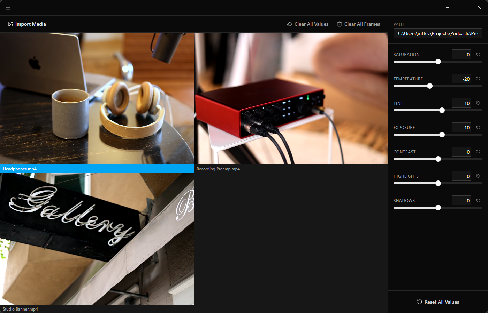

# Descript Color Grade

A color grading companion app for [Descript](https://www.descript.com/). Load images or video clips into a side-by-side grid, adjust 7 color sliders (exposure, contrast, saturation, temperature, tint, highlights, shadows), and see a live preview that exactly matches what Descript produces. Tune the look you want here, then enter the same values in Descript's color adjustment panel.

Runs Descript's actual color grade shader, so the preview is pixel-identical to Descript's output.

## Download

Grab the latest build from the [Releases](https://github.com/visionsofparadise/descript-color-grade/releases) page:

| Platform | File             |
| -------- | ---------------- |
| Windows  | `.exe`           |
| macOS    | `.zip` or `.dmg` |
| Linux    | `.deb`, `.rpm`   |

Builds are unsigned, so your OS will likely show a warning on first launch.
